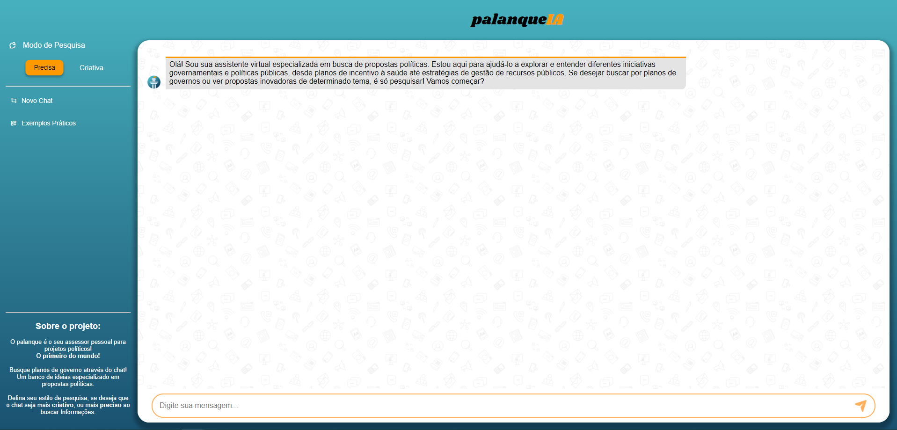

# PalanqueIA: Um Framework de Chatbot para Recuperação de Planos de Governo Usando RAG e Modelos de Linguagem de Grande Escala

## Visão Geral
PalanqueIA é um framework de chatbot projetado para melhorar o acesso aos planos de governo propostos por candidatos políticos, utilizando **Retrieval-Augmented Generation (RAG)** e **Large Language Models (LLMs)**. Ele permite que os usuários busquem informações específicas em documentos governamentais extensos e sugere novas propostas com base em iniciativas semelhantes.

## Funcionalidades
- **Recuperação Guiada de Informações**: Pesquisa em um banco de dados vetorial por informações relacionadas às consultas dos usuários em planos de governo dos candidatos.
- **Respostas Contextualizadas**: Utiliza Modelos de Linguagem de Grande Escala para fornecer respostas precisas e relevantes com base nos dados recuperados.
- **ugestão de Propostas**: Sugere novas ideias com base em projetos governamentais análogos.
- **Busca Eficiente**: Otimiza o processo de busca usando embeddings vetoriais para uma recuperação de informações mais rápida e relevante.

### Exemplo de Consulta
Você pode fazer perguntas como:
#### Modo Preciso
```bash
"Propostas sobre academia ao ar livre"
```

#### Modo Criativo
```bash
"Planos de governo para saúde"
```

O chatbot irá buscar informações relevantes no banco de dados vetorial e retornar respostas contextualizadas.

### Contribuição
Este projeto contribui para o campo de Sistemas de Informação, demonstrando como a Recuperação de Informações pode ser aprimorada com modelos de linguagem avançados em contextos de busca específicos. Ele também mostra o potencial dos chatbots inteligentes para melhorar a compreensão pública sobre políticas governamentais.

---

# PalanqueIA: A Chatbot Framework for Government Plans Retrieval Using RAG and Large Language Models

## Overview
PalanqueIA is a chatbot framework designed to improve access to government plans proposed by political candidates through the use of **Retrieval-Augmented Generation (RAG)** and **Large Language Models (LLMs)**. It allows users to search for specific information within extensive government documents and suggests new proposals based on similar past initiatives.

## Features
- **Guided Information Retrieval**: Searches a vector database for information related to user queries on candidates' government plans.
- **Contextual Responses**: Utilizes Large Language Models to provide accurate and relevant answers based on retrieved data.
- **Proposal Suggestion**: Suggests new ideas based on analogous government projects.
- **Efficient Search**: Optimizes the search process by using vector embeddings for faster and more relevant information retrieval.

### Sample Query
You can ask questions like:
#### Precise mode
```bash
"Propostas sobre academia ao ar livre"
```

#### Creative mode
```bash
"Planos de governo para saúde"
```

The chatbot will search for relevant information in the vector database and return contextualized answers.

### Contributions
This project contributes to the Information Systems field by demonstrating how Information Retrieval can be enhanced with advanced language models in specific search contexts. It also shows the potential of intelligent chatbots in improving public understanding of government policies.




